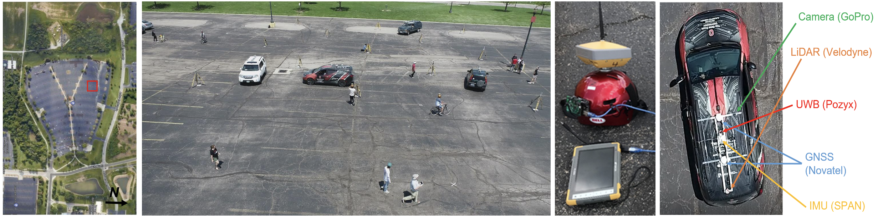

# CONTEST dataset
# Collaborative pOsitioning and NavigaTion bEtween ground and uaS plaTforms
_________________________________________________________________________
GNSS allows positioning and navigation of ground and aerial platforms/agets almost everywhere and has been widely used in a large variety of devices and applications.

But, despite developments in hardware technologies and Radio-Frequency (RF) signal processing, GNSS cannot be fully available or reliable in certain environments (e.g. dense forestry, tunnels, urban canyons, etc.) or when RF interference is present (e.g. spoofing or jamming).

Therefore, alternative positioning approaches were studied, including collaborative navigation, where platforms navigating in close vicinity can share position and navigation information (vehicle-to-infrastructure - V2I and vehicle-to-vehicle - V2V communications) and a joint navigation solution can potentially provide better results for all platforms with respect to individual ones.

The CONTEST dataset wants to provide multiple data streams to test <b>collaborative positioning</b> approaches, involving both terrestrial and aerial (Unmanned Aerial Systems / Vehicles) platforms, and using several sensors, such as Ultra-Wide Band (UWB) transceivers, cameras, LiDARs, GNSS. The CONTEST data can therefore support the development, testing and comparison of individual or integrated use of imaging data, LiDAR and UWB ranging for collaborative positioning and navigation purposes. This includes the possibility to execute and validate visual and LiDAR odometry or SLAM approaches, hybrid adjustment, UWB trilateration algorithms, etc. To ensure reliable validation results, accurate GNSS-based reference solutions are provided for all the platforms.

  
The CONTEST dataset is joint work bewtween the University of Florence (Italy), The Ohio State University (USA) and Bruno Kessler Foundation - FBK (Italy).
_________________________________________________________________________

Related publications:
- A. Masiero, L. Morelli, C. Toth, F. Remondino, 2023: <a href="https://isprs-archives.copernicus.org/articles/XLVIII-1-W2-2023/1127/2023/" target=page>Benchmarking Collaborative Poistioning and Navigation between ground and UAS Platform</a>. Int. Arch. Photogramm. Remote Sens. Spatial Inf. Sci., XLVIII-1/W2-2023, 1127–1133
- A. Masiero, C. Toth, F. Remondino, 2023: <a href="https://ieeexplore.ieee.org/document/10140067">Vision and UWB-Based Collaborative Positioning Between Ground and UAS Platforms</a>. Proc. IEEE/ION Position, Location and Navigation Symposium (PLANS), DOI: 10.1109/PLANS53410.2023.10140067
If you use this dataset for your research, please cite the data source (https://github.com/3DOM-FBK/Collaborative_Navigation)
_________________________________________________________________________

Link to dataset grouped by Agent:

| **Agent** | **Link** | **Agent** | **Link** | **Agent** | **Link** |
| --------------- | -------- | --------------- | -------- | --------------- | -------- |
| UAS1 | [Link](https://fbk.sharepoint.com/:f:/s/BENCHMARKS/EkGogSSiSo1BtPScfJf-GAQBsV318tE5iZ1oe_NStMBRmw?e=tEnrV2) | CAR0 | [Link](https://fbk.sharepoint.com/:f:/s/BENCHMARKS/EgV1D8rkMn9Gl_FUecWQDnQBEkOqpECnTk7c282ekVMDuQ?e=NfDsEo) | Pedestrian1 | [Link](https://fbk.sharepoint.com/:f:/s/BENCHMARKS/Eq5rdAjZeFJNlw3gGzykTgsBv4MnxIdgqC5xmGAadSXk_A?e=dcCQsi) |
| UAS2 | [Link](https://fbk.sharepoint.com/:f:/s/BENCHMARKS/EoHNCDe9LwBPvj7jzsck0hUBgAbOGPxbPtgI1JiLzzlWyQ?e=QK8hD0) | CAR1 | [Link](https://fbk.sharepoint.com/:f:/s/BENCHMARKS/EsD3r3abP_RJs5L_lQLh8_YB283rTo44rnBwyNilOPlfqA?e=dS0udz) | Pedestrian2 | [Link](https://fbk.sharepoint.com/:f:/s/BENCHMARKS/Els2NT-hLShMorC27s2pxtkB5GWtwRGGlLc2X7pfCjNOKA?e=NZlFoU) |
| UAS3 | [Link](https://fbk.sharepoint.com/:f:/s/BENCHMARKS/Eqa3DQB-Wf5Bh-qcJ0xTMtABsV_tB8wg4XMWPK4iDuqYdA?e=ZZdPV3) | CAR2 | [Link](https://fbk.sharepoint.com/:f:/s/BENCHMARKS/EkyXTTOPLLtKu6uaMfxUyFkBbnj4lRjxW0VM-JC2yCTdkw?e=xXT5x4) | Cyclist1 | [Link](https://fbk.sharepoint.com/:f:/s/BENCHMARKS/ElqCWAY-G6lNkeXkFPcNYqwBIHsotf-due42mxTQ0fHfNA?e=MJxf6k) |
| UAS4 | [Link](https://fbk.sharepoint.com/:f:/s/BENCHMARKS/EkGogSSiSo1BtPScfJf-GAQBsV318tE5iZ1oe_NStMBRmw?e=S5dZVT) | CAR3 | [Link](https://fbk.sharepoint.com/:f:/s/BENCHMARKS/Eisfrvs6VGpLlBnw3DEblRgB-tIEeUfgbMgkIPJDJ8vu-w?e=lhGAOt) | Cyclist2 | [Link](https://fbk.sharepoint.com/:f:/s/BENCHMARKS/EgmKfDmWCpNIgmXuEtTLyjoBcw8I1cu85LjrXsHSN3_saw?e=uaFvqS) |

For Static LiDAR: [Link](https://fbk.sharepoint.com/:f:/s/BENCHMARKS/EnHeD0qNdZJOt4W0HbCcp6IBGSXseBlcqbYpjgZLnZyMzA?e=GNOIQf) 

All collected data are listed below. 

|  
<strong> Static Infrastructure 
<strong> | 
<strong> Sensor 
<strong> | 
<strong> Collected Data 
<strong> | 
<strong> Shared Data 
<strong> |
|---|---|---|---|
|  | 12 UWB Pozyx  |  - | reference positions|
|  | LiDAR: Velodyne VLP16 | raw profiles | raw profiles with timestamp|
|  
<strong> Agents 
<strong> | 
<strong> Onboard sensor 
<strong>  |  
<strong> Collected Data 
<strong> | 
<strong> Shared Data 
<strong> |
| UAS1 | UWB: Pozyx      | ranges    | ranges wrt static and moving agents |
| UAS1 | embedded GNSS   | positions | reference trajectory                |
| UAS1 | embedded camera | images    | images                              |
| UAS2 | UWB: Pozyx      | ranges    | ranges wrt static and moving agents |
| UAS2 | GNSS: Emlid M2  | positions | reference trajectory                |
| UAS2 | embedded camera | images    | images                              |
| UAS3 | UWB: Pozyx      | ranges         | ranges wrt static and moving agents |
| UAS3 | GNSS: Emlid M2  | positions      | reference trajectory                |
| UAS3 | embedded camera | images, videos | images, videos                      |
| UAS4 | UWB: Pozyx          | ranges         | ranges wrt static and moving agents |
| UAS4 | embedded GNSS       | positions      | reference trajectory                |
| UAS4 | Camera: DJI FC6310S | images, videos | images, videos                      |
| CAR0 | UWB: Pozyx                          | ranges        | ranges wrt static and moving agents                               | 
| CAR0 | GNSS: Leica GS25, Septentrio PolRx5 | positions     | reference trajectory from GNSS and IMU integration and correction |
| CAR0 | IMU: Honeywell H764G                | inertial info | reference trajectory from GNSS and IMU integration and correction |
| CAR0 | LiDAR Velodyne VLP16                | raw profiles  | raw profiles with timestamp                                       |
| CAR1 | UWB: Pozyx                             | ranges        | ranges wrt static and moving agents                               |
| CAR1 | GNSS: Topcon Hyper VR, Novatel PwrPak7 | positions     | reference trajectory from GNSS and IMU integration and correction |
| CAR1 | IMU: SPAN-IGM-S1                       | inertial info | reference trajectory from GNSS and IMU integration and correction |
| CAR1 | LiDAR Velodyne VLP16                   | raw profiles  | raw profiles with timestamp                                       |
| CAR1 | Camera: Sony Alpha 6000                | video         | video                                                             |
| CAR2 | UWB: Pozyx                                 | -             | ranges wrt static and moving agents                               |
| CAR2 | GNSS: 1 Topcon Hyper VR, 1 Novatel PwrPak7 | positions     | reference trajectory from GNSS and IMU integration and correction |
| CAR2 | IMU: Epson G320 MEMS (built-in)            | inertial info | reference trajectory from GNSS and IMU integration and correction |
| CAR2 | LiDAR: Velodyne VLP16                      | raw profiles  | raw profiles with timestamp                                       |
| CAR2 | Camera: GoPro HERO5                        | video         | video                                                             |
| CAR3 | UWB: Pozyx                                 | ranges        | ranges wrt static and moving agents                               |
| CAR3 | GNSS: 1 Topcon Hyper VR, 1 Novatel PwrPak7 | positions     | reference trajectory from GNSS and IMU integration and correction |
| CAR3 | IMU: Epson G320 MEMS (built-in)            | inertial info | reference trajectory from GNSS and IMU integration and correction |
| CAR3 | LiDAR: Velodyne VLP16                      | raw profiles  | raw profiles with timestamp                                       |
| CAR3 | Camera: GoPro HERO5                        | video         | video                                                             |
| Pedestrian1 | GNSS: Topcon Hyper VR | positions | reference trajectory |
| Pedestrian2 | GNSS: Topcon Hyper VR | positions | reference trajectory |
| Cyclist1    | GNSS: Topcon Hyper VR | positions | reference trajectory |
| Cyclist2    | GNSS: Topcon Hyper VR | positions | reference trajectory |
| Static LiDAR | | | |

_________________________________________________________________________
### License
The data provided here is licensed under the [Creative Commons Attribution-NonCommercial-ShareAlike 4.0 International License](https://creativecommons.org/licenses/by-nc-sa/4.0/).
